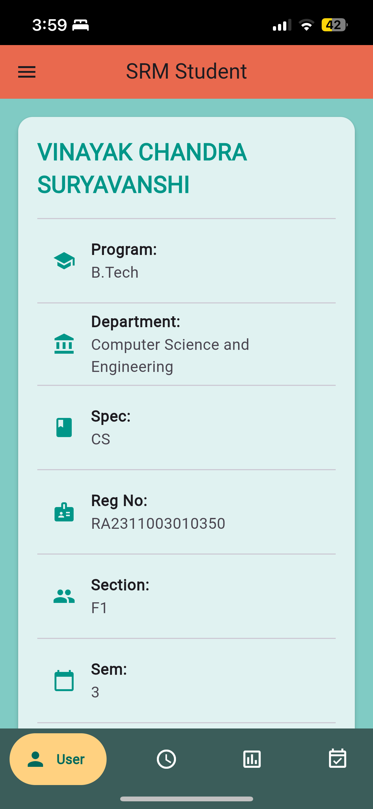
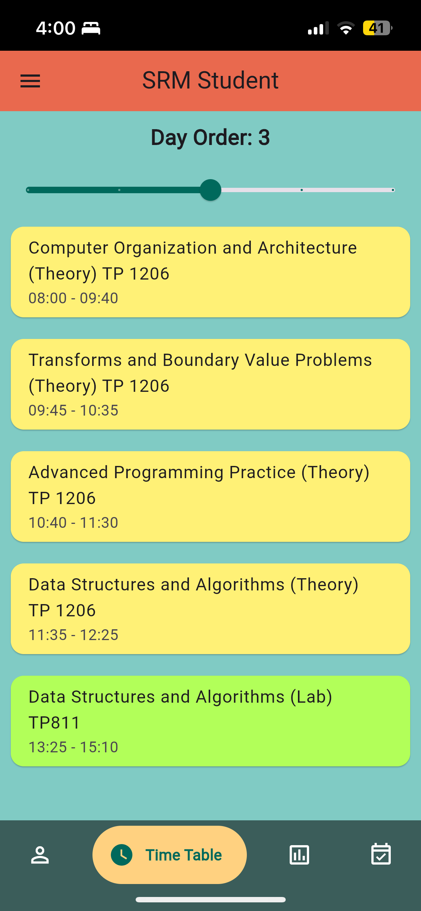
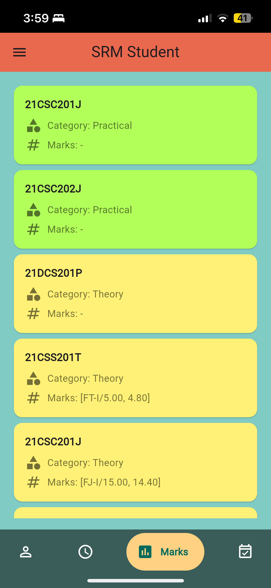
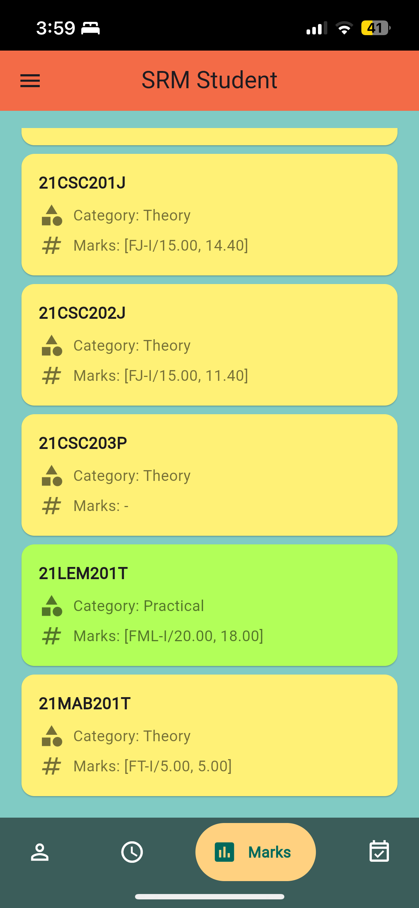
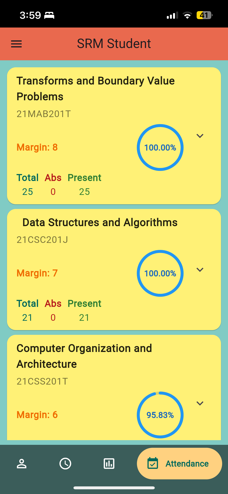
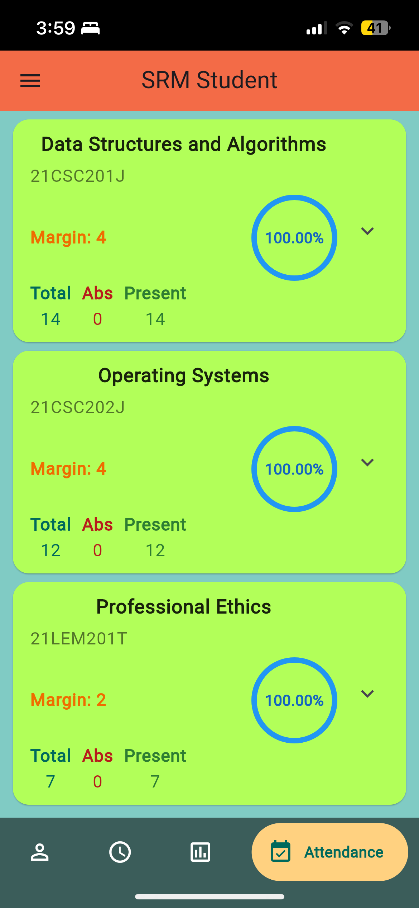
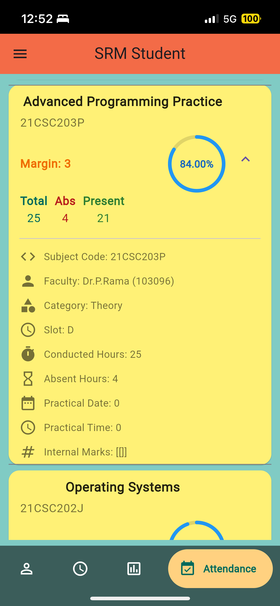

# SRM Student

A simple and intuitive `Flutter` application designed to display student attendance, marks, and timetable details. The
application aims to streamline the process of viewing student-related data in a visually appealing and efficient manner.

- **Java Version:** OpenJDK 20.0.2
- **Build Tool:** Gradle 8.3
- **Frameworks:** JavaFX for GUI

---

### 📸 Screenshots

#### User Profile

The user profile allows students to view and manage their basic details, providing easy access to personal information.

|               User               |
|:--------------------------------:|
|  |

#### Timetable View

The timetable displays the student's weekly schedule, helping them stay organized and manage their time effectively.

|                Timetable                |
|:---------------------------------------:|
|  |

#### Marks View

The marks section provides a detailed overview of the student's academic performance in various subjects, with clear
visualization of scores.

|             Marks 1             |              Marks 2               |
|:-------------------------------:|:----------------------------------:|
|  |  |

#### Attendance View

The attendance view allows students to monitor their attendance percentage across all subjects, ensuring that they are
informed of their progress.

|             Attendance View 1             |              Attendance View 2               |             Attendance View 3              |
|:-----------------------------------------:|:--------------------------------------------:|:------------------------------------------:|
|  |  |  |

